### Hi there, I'm [mμel Nova](https://nova.gal) 👋


Nova, a soon-to-be graduate student at Peking University's School of Computer Science, is currently a member of the 天枢Dubhe / 天璇Merak team at Beijing University of Posts and Telecommunications, participating in various competitions.

He is trying to do some research work related to system security in Group [vul337](https://netsec.ccert.edu.cn/chs/vul337) but without any progress.

He focused on PWN, but due to a lack of practice in recent years, he made little progress. Now, he is trying to dig deeper into kernel exploitation, though he is still a beginner.

He has a waifu `skadi(斯卡蒂)` from [Arknights](https://ak.hypergryph.com/) since 2019.

He recently has a new waifu `muelsyse(缪尔赛思)` who also comes from [Arknights](https://ak.hypergryph.com/)
> *缪缪* and *Nova* have lots in common. Check [\[是的，我更换了昵称！\]](https://nova.gal/blog/%E6%98%AF%E7%9A%84-%E6%88%91%E6%9B%B4%E6%8D%A2%E4%BA%86%E6%98%B5%E7%A7%B0) for detail. (Chinese Version only)

He likes sharing, feel free to talk to him anytime, with any question or any topic. And to argue with any point you disagree. 

He loves ACGN so much.

- 😄 Pronouns: `Mμel Nova` or `μw Nova`, or simply `Nova` / `μw` (sounds like `meow`)
- ⚡ Fun fact: He hopes that he can be a cute girl, but without any side effect ( Just like **Oyama Mahiro**! )
- ☣️ Expensive habbit: He bought a lot of domains. "[缪.org](https://xn--qq0a.org)", "[ouo.sh](https://ouo.sh)", "[ova.moe](https://ova.moe)", "[nova.gal](https://nova.gal)", "[zm.md](https://zm.md)", etc...

---


### 💻 Environment
[](https://www.microsoft.com/windows11)
[](https://archlinux.org)
[](https://www.android.com/android-14/)
[](https://github.com/yuk7/ArchWSL)


### 📫 Contact me
[](https://x.com/NovaNoir_)
[](https://t.me/muelnova)
[](https://nova.gal)

### 💰 Buy me a coffee
* [爱发电](https://afdian.net/a/NovaNo1r)

---


<!--START_SECTION:waka-->
📊 **This Week I Spent My Time On** 

```text
💬 Programming Languages: 
Python                   5 hrs 48 mins       ⬛⬛⬛⬛⬛⬛⬛⬛⬛⬜⬜⬜⬜⬜⬜⬜⬜⬜⬜⬜⬜⬜⬜⬜⬜   36.82 % 
PowerShell               1 hr 40 mins        ⬛⬛⬛⬜⬜⬜⬜⬜⬜⬜⬜⬜⬜⬜⬜⬜⬜⬜⬜⬜⬜⬜⬜⬜⬜   10.66 % 
C++                      1 hr 14 mins        ⬛⬛⬜⬜⬜⬜⬜⬜⬜⬜⬜⬜⬜⬜⬜⬜⬜⬜⬜⬜⬜⬜⬜⬜⬜   07.84 % 
JSON                     1 hr 13 mins        ⬛⬛⬜⬜⬜⬜⬜⬜⬜⬜⬜⬜⬜⬜⬜⬜⬜⬜⬜⬜⬜⬜⬜⬜⬜   07.75 % 
Other                    56 mins             ⬛⬛⬜⬜⬜⬜⬜⬜⬜⬜⬜⬜⬜⬜⬜⬜⬜⬜⬜⬜⬜⬜⬜⬜⬜   06.00 % 

🐱‍💻 Projects: 
syzkaller                8 hrs 33 mins       ⬛⬛⬛⬛⬛⬛⬛⬛⬛⬛⬛⬛⬛⬛⬜⬜⬜⬜⬜⬜⬜⬜⬜⬜⬜   54.32 % 
tcl                      3 hrs 52 mins       ⬛⬛⬛⬛⬛⬛⬜⬜⬜⬜⬜⬜⬜⬜⬜⬜⬜⬜⬜⬜⬜⬜⬜⬜⬜   24.63 % 
game-of-yap              54 mins             ⬛⬜⬜⬜⬜⬜⬜⬜⬜⬜⬜⬜⬜⬜⬜⬜⬜⬜⬜⬜⬜⬜⬜⬜⬜   05.73 % 
minecraft_youtube        45 mins             ⬛⬜⬜⬜⬜⬜⬜⬜⬜⬜⬜⬜⬜⬜⬜⬜⬜⬜⬜⬜⬜⬜⬜⬜⬜   04.81 % 
mips                     38 mins             ⬛⬜⬜⬜⬜⬜⬜⬜⬜⬜⬜⬜⬜⬜⬜⬜⬜⬜⬜⬜⬜⬜⬜⬜⬜   04.12 % 

💻 Operating System: 
WSL                      13 hrs 31 mins      ⬛⬛⬛⬛⬛⬛⬛⬛⬛⬛⬛⬛⬛⬛⬛⬛⬛⬛⬛⬛⬛⬜⬜⬜⬜   85.80 % 
Windows                  1 hr 56 mins        ⬛⬛⬛⬜⬜⬜⬜⬜⬜⬜⬜⬜⬜⬜⬜⬜⬜⬜⬜⬜⬜⬜⬜⬜⬜   12.30 % 
Mac                      17 mins             ⬜⬜⬜⬜⬜⬜⬜⬜⬜⬜⬜⬜⬜⬜⬜⬜⬜⬜⬜⬜⬜⬜⬜⬜⬜   01.90 % 
```

**I Mostly Code in Python** 

```text
Python                   27 repos            ⬛⬛⬛⬛⬛⬛⬛⬛⬛⬛⬛⬛⬛⬛⬜⬜⬜⬜⬜⬜⬜⬜⬜⬜⬜   54.00 % 
Shell                    3 repos             ⬛⬛⬜⬜⬜⬜⬜⬜⬜⬜⬜⬜⬜⬜⬜⬜⬜⬜⬜⬜⬜⬜⬜⬜⬜   06.00 % 
TypeScript               2 repos             ⬛⬜⬜⬜⬜⬜⬜⬜⬜⬜⬜⬜⬜⬜⬜⬜⬜⬜⬜⬜⬜⬜⬜⬜⬜   04.00 % 
TeX                      1 repo              ⬜⬜⬜⬜⬜⬜⬜⬜⬜⬜⬜⬜⬜⬜⬜⬜⬜⬜⬜⬜⬜⬜⬜⬜⬜   02.00 % 
HTML                     1 repo              ⬜⬜⬜⬜⬜⬜⬜⬜⬜⬜⬜⬜⬜⬜⬜⬜⬜⬜⬜⬜⬜⬜⬜⬜⬜   02.00 % 
```


<!--END_SECTION:waka-->

<details>
<summary> Metrics Details </summary>



</details>
