### Hi there, I'm [mμel Nova](https://nova.gal) 👋


Nova, graduate student at Peking University's School of Computer Science, was a PWNER of the 天枢Dubhe team at Beijing University of Posts and Telecommunications.

He focus on some research work related to system security in Group [vul337](https://netsec.ccert.edu.cn/chs/vul337) & [pkucc](https://github.com/pkucclab)

He has a waifu `skadi(斯卡蒂)` from [Arknights](https://ak.hypergryph.com/) since 2019.

He recently has a new waifu `muelsyse(缪尔赛思)` who also comes from [Arknights](https://ak.hypergryph.com/)
> *缪缪* and *Nova* have lots in common. Check [\[是的，我更换了昵称！\]](https://nova.gal/blog/%E6%98%AF%E7%9A%84-%E6%88%91%E6%9B%B4%E6%8D%A2%E4%BA%86%E6%98%B5%E7%A7%B0) for detail. (Chinese Version only)

He likes sharing, feel free to talk to him anytime, with any question or any topic. And to argue with any point you disagree. 

He used to love ACGN, but not now.

- 😄 Pronouns: `Mμel Nova` or `μw Nova`, or simply `Nova` / `μw` (sounds like `meow`)
- ⚡ Fun fact: He hopes that he can be a cute girl, but without any side effect ( Just like **Oyama Mahiro**! )
- ☣️ Expensive habbit: He bought a lot of domains. "[缪.org](https://xn--qq0a.org)" (expired), "[ouo.sh](https://ouo.sh)" (sold), "[ova.moe](https://ova.moe)", "[nova.gal](https://nova.gal)", "[zm.md](https://zm.md)", etc...

---


### 💻 Environment
[](https://www.microsoft.com/windows11)
[](https://archlinux.org)
[](https://www.android.com/android-14/)
[](https://github.com/yuk7/ArchWSL)
[](https://www.apple.com/os/macos/)


### 📫 Contact me
[](mailto://muel@nova.gal)
[](https://x.com/NovaNoir_)
[](https://t.me/muelnova)
[](https://nova.gal)

### 💰 Buy me a coffee
* [爱发电](https://afdian.net/a/NovaNo1r)

---


<!--START_SECTION:waka-->
📊 **This Week I Spent My Time On** 

```text
💬 Programming Languages: 
Python                   32 mins             ⬛⬛⬛⬛⬛⬛⬛⬛⬛⬛⬛⬛⬛⬛⬛⬛⬛⬛⬜⬜⬜⬜⬜⬜⬜   71.84 % 
YAML                     6 mins              ⬛⬛⬛⬛⬜⬜⬜⬜⬜⬜⬜⬜⬜⬜⬜⬜⬜⬜⬜⬜⬜⬜⬜⬜⬜   15.38 % 
Markdown                 2 mins              ⬛⬛⬜⬜⬜⬜⬜⬜⬜⬜⬜⬜⬜⬜⬜⬜⬜⬜⬜⬜⬜⬜⬜⬜⬜   06.53 % 
Text                     1 min               ⬛⬜⬜⬜⬜⬜⬜⬜⬜⬜⬜⬜⬜⬜⬜⬜⬜⬜⬜⬜⬜⬜⬜⬜⬜   03.52 % 
JSON                     1 min               ⬛⬜⬜⬜⬜⬜⬜⬜⬜⬜⬜⬜⬜⬜⬜⬜⬜⬜⬜⬜⬜⬜⬜⬜⬜   02.66 % 

🐱‍💻 Projects: 
cve_analyzer             34 mins             ⬛⬛⬛⬛⬛⬛⬛⬛⬛⬛⬛⬛⬛⬛⬛⬛⬛⬛⬛⬜⬜⬜⬜⬜⬜   76.25 % 
CVEExtraction            10 mins             ⬛⬛⬛⬛⬛⬛⬜⬜⬜⬜⬜⬜⬜⬜⬜⬜⬜⬜⬜⬜⬜⬜⬜⬜⬜   22.72 % 
cvelistV5                0 secs              ⬜⬜⬜⬜⬜⬜⬜⬜⬜⬜⬜⬜⬜⬜⬜⬜⬜⬜⬜⬜⬜⬜⬜⬜⬜   01.02 % 

💻 Operating System: 
Mac                      44 mins             ⬛⬛⬛⬛⬛⬛⬛⬛⬛⬛⬛⬛⬛⬛⬛⬛⬛⬛⬛⬛⬛⬛⬛⬛⬛   100.00 % 
```

**I Mostly Code in Python** 

```text
Python                   27 repos            ⬛⬛⬛⬛⬛⬛⬛⬛⬛⬛⬛⬛⬛⬛⬜⬜⬜⬜⬜⬜⬜⬜⬜⬜⬜   57.45 % 
Go                       2 repos             ⬛⬜⬜⬜⬜⬜⬜⬜⬜⬜⬜⬜⬜⬜⬜⬜⬜⬜⬜⬜⬜⬜⬜⬜⬜   04.26 % 
TypeScript               2 repos             ⬛⬜⬜⬜⬜⬜⬜⬜⬜⬜⬜⬜⬜⬜⬜⬜⬜⬜⬜⬜⬜⬜⬜⬜⬜   04.26 % 
TeX                      1 repo              ⬛⬜⬜⬜⬜⬜⬜⬜⬜⬜⬜⬜⬜⬜⬜⬜⬜⬜⬜⬜⬜⬜⬜⬜⬜   02.13 % 
HTML                     1 repo              ⬛⬜⬜⬜⬜⬜⬜⬜⬜⬜⬜⬜⬜⬜⬜⬜⬜⬜⬜⬜⬜⬜⬜⬜⬜   02.13 % 
```


<!--END_SECTION:waka-->

<details>
<summary> Metrics Details </summary>



</details>
